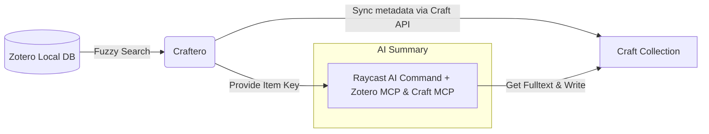

# Craftero

<div align="center">
  
</div>
</p>

## Overview

Craftero bridges your research workflow between Zotero and Craft. It enables fast, fuzzy searching of your Zotero library directly from Raycast and syncs items into structured Craft collections with AI-powered summaries.



## Demo

<div align="center">

https://github.com/user-attachments/assets/3d03774a-b3f7-488b-b28f-a3999f2ad280

</div>

## Features

- Local-first Zotero database access (no cloud API required)
- Fast fuzzy search across titles, authors, tags, DOI, abstracts, and citation keys
- Collection dropdown to filter search results by specific Zotero collections
- Smart sync with automatic deduplication by Zotero URI
- Batch sync all visible search results to Craft at once
- Multiple sync workflows: Sync, Sync & Open in Craft, Sync & AI Summarize
- Optional sync of Zotero notes and PDF annotations
- Daily note linking in Craft for reading dates
- Item management actions: copy item keys, delete from Craft, open URL/DOI, open in Zotero
- AI integration via Raycast AI Commands with MCP server support for automated paper summaries

## Installation

### Prerequisites

- [Raycast](https://raycast.com)
- [Zotero](https://www.zotero.org)
- [Craft](https://www.craft.do)

### Step 1: Duplicate Craft Template

Duplicate the [Craftero Template](https://key.craft.me/J0q5mDobFLYSm4) to your Craft Space:

| Craft Field Name | Type | Zotero Metadata |
| :--- | :--- | :--- |
| **Title** | Title (Primary) | Paper Title |
| **Citation Key** | Text | Zotero Item Key (Generated by [Better BibTeX](https://github.com/retorquere/zotero-better-bibtex)) |
| **Author(s)** | Text | Creator list (First Last) |
| **Publication Year** | Text | Publication Year |
| **Journal/Publisher** | Text | Journal name or Publisher |
| **Abstract** | Text | Item Abstract |
| **Tags** | Multiple Select | Zotero Tags |
| **Zotero URI** | URL | `zotero://select/library/items/<Item Key>` |
| **Status** | Single Select | Defaulted to "To Read" if options exist |
| **Date Added** | Date | Zotero Date Added |
| **Reading Date** | Link to Block | Link current collection item as backlink of daily note |

<details>
<summary><strong>View the Collection fields in Craft</strong></summary>

</details>

### Step 2: Install Extension

Craftero has been submitted to the Raycast Store and is pending review. Currently, you can install it locally:

```bash
git clone https://github.com/TomBener/craftero
cd craftero
npm install
npm run dev
```

The extension will appear in Raycast immediately. You can stop the process (⌃ + C) after installation, Craftero will remain available in Raycast.

### Step 3: Configure Settings

| Setting | Description | Default |
| :--- | :--- | :--- |
| **Zotero Path** | Path to `zotero.sqlite` | `~/Zotero/zotero.sqlite` |
| **API Base URL** | Craft API endpoint (e.g., `https://connect.craft.do/api/...`) | - |
| **API Key** | Craft Secret API key | - |
| **Space ID** | Required for deep links to open Craft app | - |
| **Collection ID** | The unique ID of your Craft collection | - |
| **Sync Notes** | Include Zotero notes and PDF annotations | `true` |
| **Max Items** | Max results to show in search | `10` |


<details>
<summary><strong>Use API for All Documents or Selected Documents?</strong></summary>
To sync "Reading Date" as a daily note link, use the <a href="https://connect.craft.do/api-docs/space"><strong>All Documents</strong></a> API. If you don't need this feature, you can use the <a href="https://connect.craft.do/api-docs/documents">Selected Documents</a> API instead.
</details>

<details>
<summary><strong>How to get Space ID?</strong></summary>
Open any document in Craft and copy the deeplink (⌘ + ⌥ + L). You'll get a URL like <code>craftdocs://open?blockId=5E8FD524-1E73-461A-895A-FDF6E18E8507&spaceId=123e4567-e89b-12d3-a456-426614174035</code>. The Space ID is the value after <code>spaceId=</code>.
</details>

<details>
<summary><strong>How to get Collection ID?</strong></summary>
To get your Collection ID, duplicate the <a href="https://key.craft.me/J0q5mDobFLYSm4">template collection</a> to your Craft space. Right-click to open the context menu, select <code>Copy As -> Deeplink</code>, and you'll get a URL like <code>craftdocs://open?blockId=7f2a4c91-5e3b-4d6a-b9e2-1c8d3f5a7b2e&spaceId=a1b2c3d4-e5f6-7g8h-9i0j-k1l2m3n4o5p6</code>. The Collection ID is the value after <code>blockId=</code>.


</details>

### Step 4: Enable AI Summarization with MCP

To enable the AI summarization feature, install two MCP servers in Raycast:

| [Zotero MCP](https://github.com/54yyyu/zotero-mcp) | [Craft MCP](https://www.craft.do/imagine/guide/mcp/raycast) |
| :------------: | :-----------: |
|  |  |

Create an AI Command in Raycast named `AI Summary with MCP to Craft`.

<details>
<summary><strong>View AI Command screenshot</strong></summary>

</details>

> [!NOTE]
> The AI Command name must exactly match the name above for Craftero to invoke it correctly. You can import this [AI Command JSON](ai-commands/ai-summary-with-mcp-to-craft.json) directly into Raycast.

<details>
<summary><strong>View the AI Command prompt</strong></summary>

```markdown
@zotero @craft {argument name="PaperInfo"}

Please help me summarize this paper and write the summary to Craft.

**Task Steps:**
1. Parse the data above to extract:
   - Zotero Item Key
   - Zotero URI

2. Use @zotero tool `zotero-zotero_get_item_fulltext` to fetch the full text
   - If unavailable, use `zotero-zotero_get_item_metadata` with `include_abstract: true`

3. Read the paper and write a comprehensive summary in the same language as the paper:
   - **Background & Research Question**: What problem does this paper address?
   - **Data & Methods**: What data and methods are used? Key contributions and innovation?
   - **Results & Conclusions**: Main findings? Practical implications?

4. Write the summary to Craft:
   - **Skip verification step** - directly write to the collection item
   - Use `craft-collections_list` (no arguments) to list collections
   - Pick the collection whose schema includes property key `zotero_uri`
   - Call `craft-collectionItems_get` with:
     - collectionBlockId: <Picked Collection ID>
     - maxDepth: 0
   - Find the collection item whose properties.zotero_uri equals <Zotero URI>
   - Use that item's id as the pageId
   - Call `craft-markdown_add` with:
     - position: { position: "end", pageId: <Matched Item ID> }
     - markdown: `## AI Summary\n\n<summary text>`

**Important:**
- Do NOT include paper metadata (title, authors, year, journal) in summary
- Do NOT use craft-blocks_get for verification - it may fail for collection items
- If collection lookup or craft-markdown_add fails, reply "Not added"

**Reply:** "Added" if successful, "Not added" if failed. No details needed.
```

</details>

## Usage

1. Open Raycast and search for **Craftero**
2. Type your search query (title, author, tag, etc.)
3. You can filter by Zotero collection using the dropdown at the top-right
4. Select an item and choose an action:

| Action | Shortcut | Description | Note |
| -------- | ---------- | ------------- | ------ |
| **Sync Item to Craft** | Enter | Sync selected item | |
| **Sync & Open in Craft** | ⌘ + ↩ | Sync and open in Craft | |
| **Sync & AI Summarize** | ⌘ + S | Sync item and invoke AI Command to summarize full text | |
| **Open Existing in Craft** | ⌘ + ⇧ + O | Open synced item in Craft | Only visible if item exists in Craft |
| **Copy Item Key** | ⌘ + ⇧ + I | Copy Zotero item key to clipboard | |
| **Delete from Craft** | ⌘ + ⇧ + D | Remove item from Craft | Only visible if item exists in Craft |
| **Sync All Results** | ⌘ + ⇧ + A | Sync all visible results | 10 items by default |
| **Open in Zotero** | ⌘ + ⇧ + Z | Open item in Zotero | |
| **Open URL** | ⌘ + ⇧ + U | Open item's URL or DOI in browser | |

## Troubleshooting

### Database locked

Quit Zotero and try again. Zotero locks the database while it's running to prevent concurrent access.

### Daily note not found

The daily note for today doesn't exist yet. Create it in Craft or the field will be skipped.

### Field not mapping

Check that your Craft collection has a field with a matching name. Field names are case-insensitive.

> [!NOTE]
> The Citation Key field is extracted from Zotero's `Extra` field generated by Better BibTeX and will be empty if not present in your Zotero item.

### No results found

- Verify that the Zotero database path is correct in settings
- Try a simpler or more specific search query
- Adjust the cache period in settings or restart Raycast

## License

MIT License - see [LICENSE](LICENSE) for details
